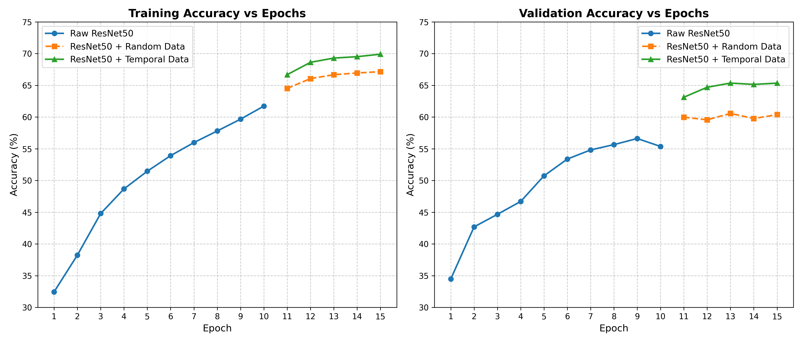
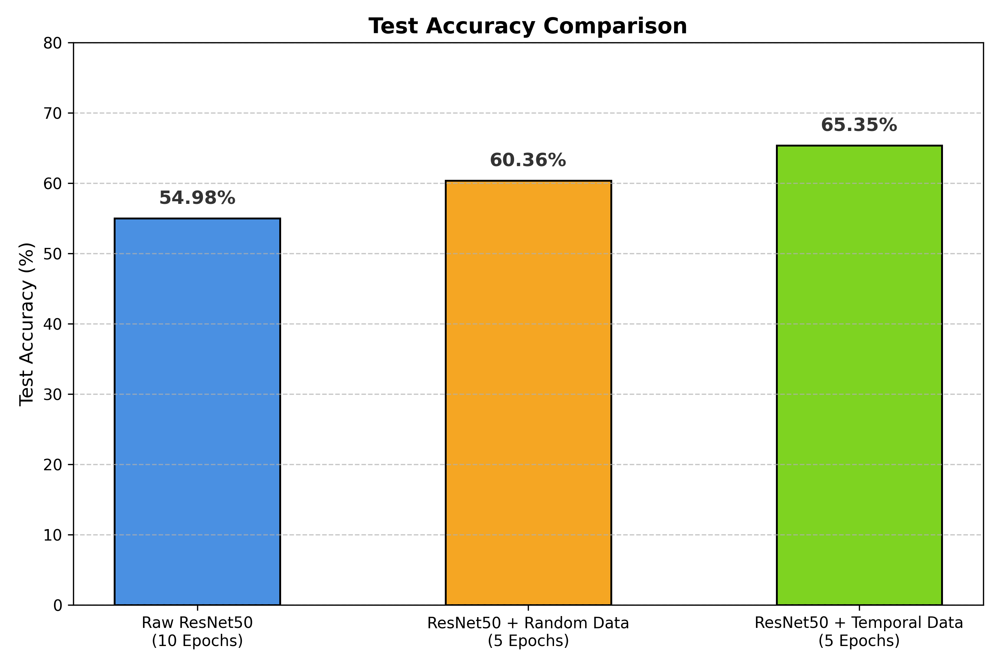

# Tempor-Net: Enhancing Image Classification with Temporal Data

[](https://opensource.org/licenses/MIT)
[](https://www.python.org/downloads/)
[](https://pytorch.org/)

> **Authors**: Mohan Cao, Bohao Chen, Yudong Yang  
> **Institution**: University of Washington  
> **Course**: CSE 493 Final Project

## 📖 Abstract

Tempor-Net explores the fusion of spatial/image data with temporal and tabular features to improve classification performance. We demonstrate that by augmenting a standard image-based architecture (ResNet-50) with an auxiliary multi-layer perceptron (MLP) for temporal data, the model can achieve higher validation and test accuracies compared to image-only baselines. The project operates on geographical classification tasks (e.g., classifying continents/regions) utilizing the OpenStreetView-5M (OSV-5M) dataset.

## 🏗️ Architecture

Our experiments evaluate three primary model configurations:
1. **Baseline ResNet-50**: Standard ResNet-50 operating only on image crops.
2. **ResNet-50 + Random MLP**: ResNet-50 features concatenated with a randomly initialized MLP (ablation study).
3. **Mohanet (ResNet-50 + Temporal MLP)**: Our proposed fusion architecture that takes the 2048-dimensional output from the ResNet-50 stem and concatenates it with temporal metadata features prior to a fully connected fusion classifier.

<p align="center">
  <!-- TODO: Replace with actual architecture figure from 'Project Poster.pdf' if available -->
  
</p>

## 📊 Dataset

We utilize a 10-class subset of the **OpenStreetView-5M (OSV-5M)** dataset. Data preprocessing involves extracting uniform crops (224x224) and matching images with their corresponding temporal metadata.

- `osv5m_10_class_iso.json`: Configuration/Classes for the 10-class dataset setup.
- Images are expected to be organized in a standard `ImageFolder` structure under `data/train` and `data/test`.

## ⚙️ Installation & Requirements

1. Clone the repository:
   ```bash
   git clone https://github.com/your-username/tempor-net.git
   cd tempor-net
   ```
2. Install dependencies. We highly recommend using a Virtual Environment or Anaconda:
   ```bash
   pip install torch torchvision numpy matplotlib
   ```

## 🚀 Usage

### Training

To train the baseline image-only ResNet-50 model on the dataset:

```bash
python main.py \
    --data_dir data \
    --epochs 10 \
    --batch_size 256 \
    --learning_rate 0.1 \
    --save_plot_dir "plotted figrues"
```

To train the Mohanet fusion model, ensure your dataset includes the temporal features and use the configured training routines inside the repo.

*Key Arguments (see `main.py` for full details):*
- `--data_dir`: Path to the top-level data folder.
- `--epochs`: Number of training epochs.
- `--batch_size`: Batch size for the dataloaders.
- `--lr_factor` / `--lr_patience`: Hyperparameters for `ReduceLROnPlateau`.
- `--no_show_plots`: Add this flag to train headlessly without popping up plot windows.

### Evaluation & Visualization

Evaluate specific models using the `eval.py` module. Visualizations comparing the three models (e.g., test accuracy bar charts, training loss lines) can be generated using `plot_results.py`:

```bash
python plot_results.py
```

This will save visual summaries to the output directory (e.g., `test_accuracy_bar_chart.png` and `train_val_accuracy_lines.png`).

## 📈 Results

Our results demonstrate that concatenating temporal features with visual features significantly boosts classification accuracy. 

* **Validation/Test Enhancements**: Mohanet outperforms the raw ResNet-50 baseline and the Random MLP baseline, demonstrating that structured temporal data provides a robust signal for geographical image classification.

<p align="center">
  
</p>

## 📜 Citation

If you find this project useful or build upon our methods, please consider citing our work:

```bibtex
@misc{tempornet2026,
  author = {Your Name/Team},
  title = {Tempor-Net: Enhancing Image Classification with Temporal Data},
  year = {2026},
  publisher = {GitHub},
  journal = {GitHub repository},
  howpublished = {\url{https://github.com/your-username/tempor-net}}
}
```

## 🙏 Acknowledgements

- **OpenStreetView-5M**: For providing the core dataset.
- **CSE 493**: Instructors and TAs for project guidance.